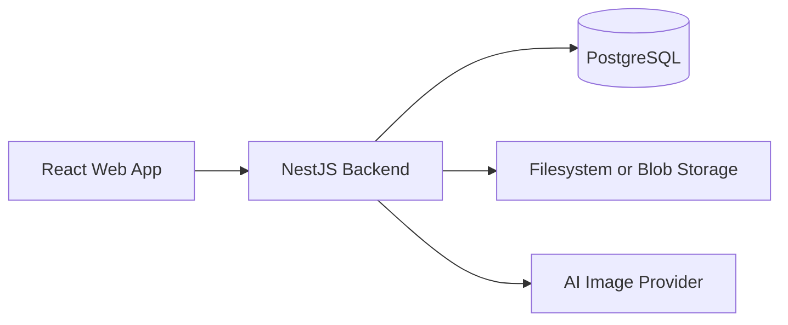
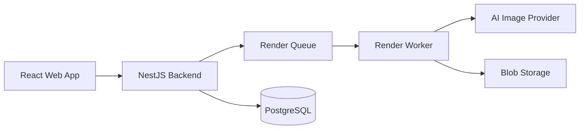

# 02 — Architecture

## Purpose

This document describes the initial architecture of CasaStudio and the reasoning behind it.

## Architecture style

CasaStudio starts as:

```text
Monorepo + Modular Monolith + Cloud Ready
```

This means one repository, one main backend application, clear module boundaries, shared packages, local-first development, future cloud deployment, and future service extraction only when needed.

## Why not microservices now

Microservices would add premature complexity: multiple deployments, internal networking, distributed logging, service-to-service contracts, distributed failure modes, increased setup time, and slower iteration.

## MVP logical architecture



## Future architecture



## Frontend responsibilities

The frontend renders the 2D blueprint, generates the 3D scene in the browser, provides navigation, manages UI state, saves viewpoints, exports PNG images, sends render requests, and displays the gallery.

## Backend responsibilities

The backend handles project persistence, model validation, viewpoints, render metadata, image storage, AI provider calls, APIs, and temporary access control.

## RenderModule

In the MVP, `RenderModule` is part of the NestJS backend. It receives screenshots and prompts, validates input, creates render records, calls `AiImageProvider`, stores images, updates status, and returns metadata.

## Module boundaries

`packages/geometry` must not depend on React, NestJS, Prisma, or Three.js. `packages/schema` must not depend on application code. Domain logic should not live directly in UI components or controllers.
