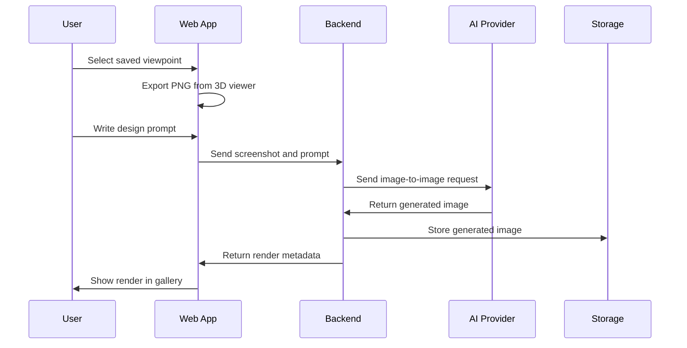

# 05 — AI Integration

## Purpose

This document defines how CasaStudio integrates AI image generation into the application.

## Goal

The AI workflow must be available inside the web app. The user should not manually export screenshots, open another AI tool, upload images, download outputs, and organize files manually.

## MVP flow



## Prompt strategy

Generated renders must preserve the geometry of the exported 3D view. A default instruction should be prepended:

```text
Use the provided 3D view as the strict geometric reference.
Keep the room layout, wall positions, openings, mezzanine, staircase and proportions unchanged.
Generate an interior design render according to the following style and requirements:
```

## Provider adapter

```text
RenderService
  ↓
AiImageProvider
  ↓
OpenAIImageProvider
```

The first provider is OpenAI Image API. Future providers may include Stability, Replicate, Flux-based providers, or local generation pipelines.

## Worker evolution

The MVP can call the AI provider directly from the backend. A worker is introduced only for long-running jobs, batch generation, retry handling, multi-user load, cost control, or queue-based processing.
