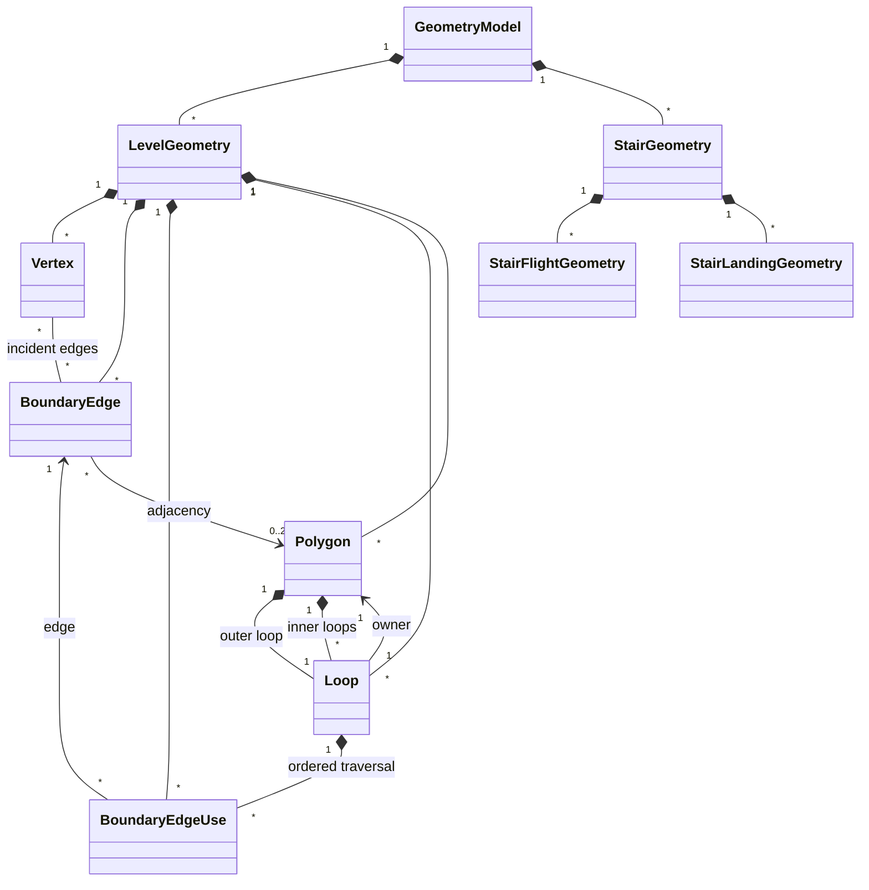
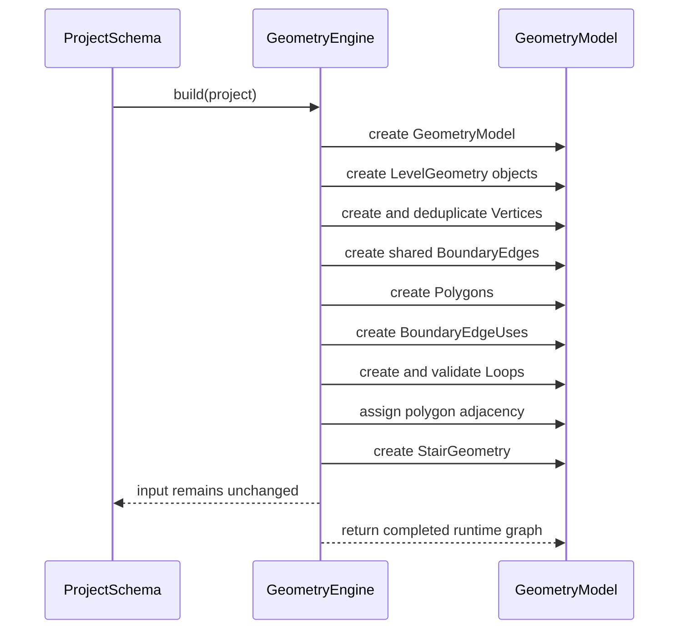

# Geometry Runtime Model

> **Status:** Draft

---

# Purpose

This document describes the in-memory geometry model used by CasaStudio.

Unlike the persisted `ProjectSchema`, which represents architectural concepts, the Geometry Runtime Model represents the building from a geometric and topological perspective.

Its primary purpose is to support:

- geometric algorithms;
- topology traversal;
- 2D rendering;
- 3D rendering;
- exporters;
- future spatial analysis.

The runtime model is produced by the `GeometryEngine` and exists only in memory.

---

# Relationship with ADR-006

ADR-006 defines the architecture of the Geometry Engine and the boundaries between:

- `ProjectSchema`;
- `GeometryEngine`;
- `GeometryModel`;
- renderers and exporters.

This document specifies the runtime objects that compose the `GeometryModel`.

Whenever possible:

- architectural decisions belong to ADR-006;
- runtime object design belongs to this document;
- implementation-specific details belong to the source code.

The `GeometryModel` is the public contract between the Geometry Engine and every downstream consumer.

Renderers, exporters, and external geometric algorithms must consume the `GeometryModel` and must not access `ProjectSchema` directly.

---

# Document Status

This document is a living technical design document.

Unlike an accepted ADR, it may evolve as the Geometry Runtime Model gains new capabilities.

Changes to this document must remain compatible with the architectural constraints established by ADR-006.

---

# Design Principles

## Geometry over Architecture

Runtime objects represent geometry rather than architectural semantics.

For example:

- a domain `Room` produces a runtime `Polygon`;
- a domain `Wall` produces a runtime `BoundaryEdge`;
- a domain `Level` produces a runtime `LevelGeometry`;
- a domain `Staircase` produces runtime staircase geometry.

The runtime model is optimized for geometric and topological reasoning.

Architectural objects may be retained as traceability references, but they do not define the runtime topology.

---

## Explicit Topology

Topology is represented explicitly.

Objects know their neighboring objects whenever doing so simplifies traversal and geometric algorithms.

For example:

- vertices know their incident boundary edges;
- boundary edges know their endpoint vertices;
- boundary edge uses know the loop in which an edge is traversed;
- loops know their ordered boundary edge uses;
- polygons know their outer and inner loops.

Ordinary topology traversal should not require reconstructing relationships from source identifiers.

---

## Shared Geometry

Every physical geometric entity exists only once within its ownership scope.

If two rooms share one physical wall, both polygons reference the same `BoundaryEdge`.

Duplicated runtime geometry is not allowed.

The direction in which a shared edge is traversed does not belong to the `BoundaryEdge` itself. It belongs to a `BoundaryEdgeUse` contained by a specific loop.

---

## Stateless Construction

The Geometry Model is entirely reconstructed by the `GeometryEngine`.

Runtime objects:

- are not persisted;
- are not the source of truth;
- must not mutate the input `ProjectSchema`;
- may be discarded and rebuilt when the domain model changes.

The `GeometryEngine` is responsible for producing a coherent runtime object graph from the persisted domain model.

---

## Renderer Neutrality

The Geometry Model contains geometric and topological information, not renderer-specific data.

It must not contain:

- Three.js objects;
- GPU resources;
- renderer-specific meshes;
- SVG nodes;
- Canvas objects;
- PDF drawing commands;
- renderer-specific triangulation results.

A renderer may derive those resources from the Geometry Model.

---

## One Model for 2D and 3D

The same Geometry Model supports both 2D and 3D consumers.

A 2D renderer primarily consumes planar coordinates and level-local topology.

A 3D renderer additionally consumes:

- level elevations;
- wall heights;
- opening elevations;
- staircase geometry;
- other vertical information.

Separate 2D and 3D geometry engines are not required.

---

# Object Overview

The runtime model is organized by building level, with independent geometry for elements that connect or span multiple levels.

```text
GeometryModel
│
├── LevelGeometry
│   ├── Vertex
│   ├── BoundaryEdge
│   ├── BoundaryEdgeUse
│   ├── Loop
│   └── Polygon
│
└── StairGeometry
    ├── StairFlightGeometry
    └── StairLandingGeometry
```

The core planar topology is composed of:

```text
Vertex
   │
   ▼
BoundaryEdge
   ▲
   │
BoundaryEdgeUse
   │
   ▼
Loop
   │
   ▼
Polygon
```

`BoundaryEdgeUse` separates physical edge identity from loop traversal direction.

---

# GeometryModel

Represents the complete in-memory geometric model of one project.

## Responsibilities

- own all runtime geometry objects;
- organize planar geometry by level;
- own staircase geometry connecting or spanning levels;
- provide model-level lookup and traversal;
- retain project-level traceability;
- define the lifetime of all runtime objects.

## Typical Properties

```text
id
sourceProjectId
levels
staircases
```

Possible future properties:

```text
sourceRevision
metadata
```

## Expected API

```text
levels()

staircases()

getLevel(id)

getVertex(id)

getBoundaryEdge(id)

getLoop(id)

getPolygon(id)

findPolygonByRoomId(roomId)

findBoundaryEdgeByWallId(wallId)

findStairGeometryByStaircaseId(staircaseId)
```

The Geometry Model owns runtime objects even when those objects contain bidirectional references to one another.

---

# LevelGeometry

Represents all planar geometry belonging to one building level.

## Responsibilities

- group geometric objects by level;
- provide the elevation required to place planar geometry in 3D space;
- provide efficient access to the geometry of one level;
- preserve traceability to the source domain level.

## Typical Properties

```text
id
sourceLevelId
elevation
vertices
boundaryEdges
boundaryEdgeUses
loops
polygons
```

## Expected API

```text
elevation()

vertices()

boundaryEdges()

loops()

polygons()

getVertex(id)

getBoundaryEdge(id)

getLoop(id)

getPolygon(id)

findPolygonByRoomId(roomId)

findBoundaryEdgeByWallId(wallId)
```

A 2D blueprint renderer may consume one `LevelGeometry`.

A whole-building 3D renderer may consume all level geometries from the `GeometryModel`.

---

# Vertex

Represents a unique geometric point within a level.

## Responsibilities

- store planar coordinates;
- identify one unique point in level-local space;
- provide adjacency information;
- act as the endpoint of one or more boundary edges.

## Typical Properties

```text
id
position
incidentEdges
level
```

The planar position is expressed using the coordinate convention established by the CasaStudio coordinate-system documentation.

Conceptually:

```text
position.x
position.z
```

Vertical placement is normally derived from the owning `LevelGeometry` elevation rather than duplicated in every vertex.

A renderer or algorithm may obtain a world-space position equivalent to:

```text
x = position.x
y = level.elevation
z = position.z
```

The exact axis convention remains governed by the project coordinate-system specification.

## Expected API

```text
position()

level()

addIncidentEdge(edge)

removeIncidentEdge(edge)

incidentEdges()

degree()
```

A vertex has no knowledge of architectural concepts such as rooms or walls.

---

# BoundaryEdge

Represents one physical geometric boundary segment.

A `BoundaryEdge` commonly derives from one domain `Wall`, but it remains a runtime geometric object.

## Responsibilities

- connect two vertices;
- represent one physical boundary only once;
- reference adjacent polygons;
- provide geometric measurements;
- preserve traceability to the source wall;
- provide access to opening geometry associated with the boundary.

## Typical Properties

```text
id
startVertex
endVertex
leftPolygon
rightPolygon
sourceWallId
openings
```

The exact interpretation of `leftPolygon` and `rightPolygon` depends on the canonical direction from `startVertex` to `endVertex`.

An exterior boundary has only one adjacent polygon.

A shared interior boundary may have two adjacent polygons.

## Expected API

```text
start()

end()

otherVertex(vertex)

leftPolygon()

rightPolygon()

adjacentPolygons()

isExterior()

length()

sourceWallId()

openings()
```

## Constraints

A `BoundaryEdge`:

- must not own a single `parentLoop`;
- may participate in multiple loops;
- must not be duplicated merely because different loops traverse it in different directions;
- must not be split solely because it contains a door or window.

Future extensions may include:

- direction vector;
- normal calculation;
- wall thickness;
- wall height;
- geometric offset helpers.

---

# BoundaryEdgeUse

Represents the traversal of one `BoundaryEdge` inside one `Loop`.

This object separates the identity of a physical boundary from the direction in which that boundary is traversed by a loop.

## Responsibilities

- reference one shared `BoundaryEdge`;
- define the traversal direction of that edge;
- reference the containing loop;
- expose traversal-relative start and end vertices.

## Typical Properties

```text
id
edge
direction
loop
index
```

The direction is explicit:

```text
FORWARD
REVERSE
```

`FORWARD` traverses the edge from its canonical `startVertex` to its canonical `endVertex`.

`REVERSE` traverses it from its canonical `endVertex` to its canonical `startVertex`.

## Expected API

```text
edge()

direction()

loop()

index()

startVertex()

endVertex()

isForward()

isReverse()
```

## Shared Boundary Example

```text
Polygon A outer loop
└── BoundaryEdgeUse(shared-edge, FORWARD)

Polygon B outer loop
└── BoundaryEdgeUse(shared-edge, REVERSE)
```

The physical boundary exists once.

Its traversal exists once per participating loop.

---

# Loop

Represents one closed, ordered boundary traversal.

A loop contains ordered `BoundaryEdgeUse` objects rather than owning physical boundary edges directly.

## Responsibilities

- maintain an ordered boundary traversal;
- preserve edge direction;
- identify closed topology;
- provide ordered vertices and edges;
- compute planar orientation and area;
- reference its owning polygon.

## Typical Properties

```text
id
edgeUses
polygon
role
```

The loop role may distinguish:

```text
OUTER
INNER
```

## Expected API

```text
edgeUses()

edges()

vertices()

polygon()

role()

isClosed()

orientation()

signedArea()

area()
```

`edges()` may return the underlying `BoundaryEdge` objects in traversal order.

`vertices()` must respect each `BoundaryEdgeUse.direction`.

## Closure Rule

For every consecutive pair of edge uses:

```text
current.endVertex == next.startVertex
```

For a closed loop:

```text
last.endVertex == first.startVertex
```

## Orientation

Loop orientation is determined from the ordered traversal.

The canonical winding convention for outer and inner loops must be defined consistently by the Geometry Engine.

For example:

```text
outer loops: counter-clockwise
inner loops: clockwise
```

The specific convention must remain consistent across:

- adjacency assignment;
- area calculation;
- renderer consumption;
- exporter consumption.

Future extensions may include:

- cached signed area;
- cached bounding box;
- spatial indexing;
- loop normalization.

---

# Polygon

Represents one geometric region, normally derived from one domain `Room`.

## Responsibilities

- own one outer loop;
- own zero or more inner loops;
- represent one room-derived geometric region;
- provide geometric measurements;
- preserve source-room traceability.

## Typical Properties

```text
id
outerLoop
innerLoops
sourceRoomId
level
```

`innerLoops` exists in the initial API even when no current persisted domain concept produces polygon holes.

For the initial implementation:

```text
innerLoops = []
```

Support for generating holes from the domain model is outside the MVP unless introduced by a separate design decision.

## Expected API

```text
outerLoop()

innerLoops()

loops()

edges()

vertices()

level()

sourceRoomId()

containsPoint(point)

area()

centroid()
```

The initial `containsPoint` contract should operate on a geometric point rather than a `Vertex`, because point containment is not limited to existing topology vertices.

Future extensions may include:

- bounding box;
- spatial index;
- geometric metadata;
- cached measurements.

Triangulation data does not belong to `Polygon`.

---

# StairGeometry

Represents the runtime geometry of one domain staircase.

Staircases are independent geometric elements and do not participate in room boundary loops by default.

## Responsibilities

- preserve source staircase traceability;
- represent geometry connecting or spanning levels;
- own runtime stair flights and landings;
- provide all staircase information required by renderers and exporters.

## Typical Properties

```text
id
sourceStaircaseId
flights
landings
connectedLevelIds
```

## Expected API

```text
sourceStaircaseId()

flights()

landings()

connectedLevelIds()

startLevelId()

endLevelId()
```

Stair geometry belongs to the `GeometryModel`, not directly to one polygon.

A staircase renderer must not access the source `ProjectSchema` to reconstruct stair geometry.

---

# StairFlightGeometry

Represents one runtime stair flight.

## Responsibilities

- represent the geometric path and rise of one stair flight;
- preserve traceability to its source flight;
- expose data needed for 2D and 3D rendering.

## Typical Properties

```text
id
sourceFlightId
startPosition
endPosition
startElevation
endElevation
width
stepCount
```

## Expected API

```text
startPosition()

endPosition()

startElevation()

endElevation()

width()

stepCount()

length()

rise()
```

The exact flight representation may evolve when detailed stair rendering requirements are introduced.

---

# StairLandingGeometry

Represents one runtime stair landing.

## Responsibilities

- represent landing position and dimensions;
- preserve traceability to its source landing;
- provide geometry required by renderers and exporters.

## Typical Properties

```text
id
sourceLandingId
position
elevation
width
depth
```

## Expected API

```text
position()

elevation()

width()

depth()

sourceLandingId()
```

---

# Openings

Doors and windows belong to domain walls and are projected onto runtime `BoundaryEdge` objects.

Openings do not split boundary topology.

## Principles

- a wall with one opening still produces one `BoundaryEdge`;
- an opening is represented as geometry associated with that edge;
- opening placement is measured relative to the edge;
- opening geometry may contain horizontal and vertical information;
- renderers may use opening geometry to generate gaps, symbols, or wall cut-outs.

The detailed runtime opening representation may be introduced when opening rendering is implemented.

Until then, `BoundaryEdge` may retain validated source opening information or lightweight derived opening geometry.

---

# Relationships



In textual form:

```text
GeometryModel
 ├── LevelGeometry
 └── StairGeometry

LevelGeometry
 ├── Vertex
 ├── BoundaryEdge
 ├── BoundaryEdgeUse
 ├── Loop
 └── Polygon

Vertex
 └── incident BoundaryEdges

BoundaryEdge
 ├── startVertex
 ├── endVertex
 ├── leftPolygon
 ├── rightPolygon
 └── referenced by BoundaryEdgeUses

BoundaryEdgeUse
 ├── BoundaryEdge
 ├── direction
 └── Loop

Loop
 ├── ordered BoundaryEdgeUses
 └── Polygon

Polygon
 ├── outerLoop
 ├── innerLoops
 └── LevelGeometry

StairGeometry
 ├── StairFlightGeometry
 └── StairLandingGeometry
```

Relationships are direct object references where runtime traversal benefits from them.

Identifiers remain available for lookup, diagnostics, serialization of debug output, and traceability.

---

# Ownership and Lifecycle

Ownership follows this hierarchy:

```text
GeometryModel
│
├── LevelGeometry
│   ├── Vertices
│   ├── BoundaryEdges
│   ├── BoundaryEdgeUses
│   ├── Loops
│   └── Polygons
│
└── StairGeometries
    ├── StairFlightGeometries
    └── StairLandingGeometries
```

Objects may reference one another bidirectionally, but their lifetime is managed by their owning model.

Removing or rebuilding a `GeometryModel` invalidates all runtime references belonging to it.

Runtime objects must not be shared between different Geometry Model instances.

---

# Identity

Every runtime object owns a stable runtime identifier.

Runtime identifiers are not persisted as replacements for domain identifiers.

## Deterministic Identity

When a runtime object derives directly from a domain entity, its runtime identifier should normally be deterministically derived from the source identifier.

Examples:

```text
level:<level-id>
edge:<wall-id>
polygon:<room-id>
stair:<staircase-id>
stair-flight:<flight-id>
stair-landing:<landing-id>
```

Runtime objects that do not have a one-to-one domain equivalent may use deterministic composite identifiers.

Examples:

```text
loop:<polygon-id>:outer
loop:<polygon-id>:inner:<index>
edge-use:<loop-id>:<index>
```

Vertex identity may be derived from:

- canonical source information;
- a deterministic coordinate key within a level;
- another deterministic strategy defined by the Geometry Engine.

## Goals

Deterministic runtime identifiers improve:

- tests;
- diagnostics;
- selection mapping;
- rebuild comparison;
- domain-to-runtime traceability.

They remain runtime identifiers and must not become persisted domain identity by accident.

---

# Coordinate Model

Planar room topology belongs to a `LevelGeometry`.

Vertices normally store level-local planar coordinates.

Level elevation is stored once by `LevelGeometry` and is used to derive world-space positions.

Conceptually:

```text
worldPosition.x = vertex.position.x
worldPosition.y = level.elevation
worldPosition.z = vertex.position.z
```

This avoids duplicating identical level elevation across every planar vertex.

Elements with vertical extent, such as:

- walls;
- openings;
- stair flights;
- stair landings;

may store additional elevation or height information when required.

The Geometry Runtime Model must follow the coordinate system established by the project coordinate-system documentation.

This document does not independently redefine axis orientation, units, origin, or handedness.

---

# Exterior Boundaries

The initial model does not introduce a dedicated `Exterior` polygon.

A boundary is exterior when it has only one adjacent polygon.

Conceptually:

```text
leftPolygon = polygon
rightPolygon = null
```

or:

```text
leftPolygon = null
rightPolygon = polygon
```

The side used depends on the canonical boundary direction and polygon winding.

`BoundaryEdge.isExterior()` returns true when exactly one adjacent polygon is present.

A boundary with no adjacent polygons is invalid or unattached geometry and should normally produce a build error.

---

# Shared Boundaries

A physical shared wall produces one `BoundaryEdge`.

Each polygon loop references that edge through its own `BoundaryEdgeUse`.

```text
Shared BoundaryEdge
├── used by Polygon A loop in FORWARD direction
└── used by Polygon B loop in REVERSE direction
```

The Geometry Engine must detect duplicated wall geometry, including duplicates whose domain start and end coordinates are reversed.

Shared geometry must not be represented by two coincident `BoundaryEdge` objects.

---

# Inner Loops

`Polygon.innerLoops` is part of the runtime API from the initial implementation.

Initially:

```text
innerLoops = []
```

This preserves an extensible polygon contract without prematurely implementing:

- domain representation of holes;
- nesting algorithms;
- hole validation;
- courtyards;
- shafts;
- complex polygon containment.

When domain support for holes is introduced, the Geometry Engine may populate this collection without changing the public shape of `Polygon`.

---

# Construction Sequence

The Geometry Engine should conceptually construct the model in phases.



The exact implementation may use intermediate builders or adapters, but the resulting object graph must respect the ownership and topology rules in this document.

---

# Geometry Build Errors

Geometry construction has different responsibilities from persisted-schema validation.

Schema validation answers questions such as:

> Is the persisted document structurally valid?

Geometry build validation answers questions such as:

> Can this domain model produce a coherent geometric and topological runtime model?

The Geometry Engine should therefore define geometry-specific build errors rather than directly reusing schema validation errors.

Example error categories include:

```text
OPEN_BOUNDARY
INVALID_BOUNDARY_ORDER
INVALID_BOUNDARY_DIRECTION
DUPLICATE_BOUNDARY
UNKNOWN_WALL_REFERENCE
DEGENERATE_EDGE
DEGENERATE_POLYGON
NON_MANIFOLD_BOUNDARY
INVALID_ADJACENCY
INVALID_OPENING_PLACEMENT
INVALID_STAIR_GEOMETRY
```

Build errors should retain enough source identifiers and context to support:

- diagnostics;
- tests;
- editor feedback;
- migration tooling.

Geometry build errors may map to schema validation errors when useful, but the two error contracts remain distinct.

---

# Synchronization

The Geometry Model is derived from `ProjectSchema`.

It is never considered the source of truth.

Whenever the domain changes, the application is responsible for rebuilding or explicitly synchronizing the runtime model.

The initial implementation should prefer complete reconstruction over incremental mutation unless incremental synchronization is introduced through a separate design decision.

Complete rebuilding provides:

- simpler lifecycle rules;
- fewer stale references;
- deterministic results;
- easier testing.

---

# Public API Expectations

The Geometry Model is the public internal API exposed by the Geometry Engine.

Downstream consumers may depend on:

- runtime object identity;
- documented traversal relationships;
- documented geometric measurements;
- level grouping;
- source traceability;
- deterministic construction.

Downstream consumers must not depend on:

- construction order unless documented;
- mutable internal collections;
- renderer-specific representations;
- undocumented private caches;
- direct access to `ProjectSchema`.

Public collections should normally be exposed as read-only views.

Mutating topology after model construction is outside the initial runtime API.

---

# Initial Implementation Scope

The initial implementation should include:

- `GeometryModel`;
- `LevelGeometry`;
- `Vertex`;
- `BoundaryEdge`;
- `BoundaryEdgeUse`;
- `Loop`;
- `Polygon`;
- staircase runtime ownership;
- deterministic runtime identifiers;
- outer room loops;
- empty `innerLoops`;
- shared boundary representation;
- exterior boundary detection;
- source-domain traceability;
- geometry-specific build results and errors.

The initial implementation does not need to include every future geometric algorithm.

Functionality should be added incrementally when required by concrete consumers.

---

# Future Extensions

The following concepts are intentionally excluded from the initial implementation:

- curved edges;
- arcs and splines;
- B-Rep solids;
- boolean solid operations;
- structural members;
- terrain;
- arbitrary non-planar polygons;
- detailed wall solids;
- detailed opening cut geometry;
- navigation meshes;
- renderer-specific meshes;
- GPU resources;
- persisted runtime geometry;
- incremental topology editing.

They should only be introduced when concrete requirements justify their existence.

Possible future runtime additions include:

- bounding boxes;
- spatial indexes;
- cached area and centroid values;
- surface or face representations;
- richer opening geometry;
- detailed staircase solids;
- vertical adjacency;
- multi-level voids;
- polygon holes;
- geometric query services.

---

# Non-Goals

This document intentionally does not define:

- persisted domain schemas;
- rendering algorithms;
- persistence of runtime objects;
- GPU triangulation;
- Three.js integration;
- SVG implementation;
- Canvas implementation;
- PDF drawing implementation;
- DXF generation;
- IFC generation;
- editor commands;
- undo and redo behavior;
- incremental synchronization;
- detailed migration from legacy room boundaries.

Those concerns belong to other architectural or implementation documents.

---

# Architectural Invariants

The following invariants must hold for a valid Geometry Model:

1. Every runtime object belongs to exactly one `GeometryModel`.
2. Every planar runtime object belongs to exactly one `LevelGeometry`.
3. Every `BoundaryEdge` references two valid endpoint vertices.
4. Every `BoundaryEdgeUse` references exactly one boundary edge and one loop.
5. Every loop contains ordered boundary edge uses.
6. Every valid loop is closed.
7. Every polygon has exactly one outer loop.
8. Every shared physical boundary exists as one `BoundaryEdge`.
9. A shared boundary may be traversed by different loops in different directions.
10. Openings do not split boundary topology.
11. Stair geometry is owned by the Geometry Model and does not require renderer access to `ProjectSchema`.
12. Runtime objects are not persisted.
13. Runtime geometry is not the source of truth.
14. Renderers and exporters consume the Geometry Model rather than `ProjectSchema`.
15. Renderer-specific objects are not part of the Geometry Model.
